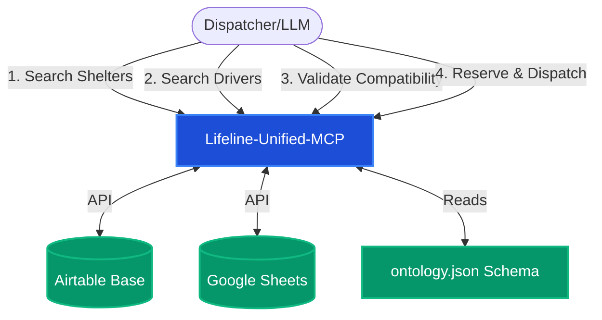

# Lifeline Model Context Protocol (MCP) System Specification

This specification document outlines the architecture, data models, tools, and constraints of the **Lifeline MCP** suite, a deterministic validation and coordination system designed for emergency resource dispatch (shelter capacity booking and volunteer transport coordination).

---

## 1. System Overview

The Lifeline MCP system is built to safely match clients in emergency situations with suitable shelter accommodations and volunteer transportation. Because user-reported accessibility metrics (such as a shelter claiming to be "wheelchair accessible" or a volunteer stating their vehicle is "wheelchair friendly") are frequently inaccurate, the system relies on a **Deterministic Physics Validation Layer** powered by an **Ontology Engine**.

### Architecture Diagram

The diagram below shows how the MCP servers interact with external resources and collaborate to validate and dispatch services.



---

## 2. MCP Servers and Tool Specifications

The suite consists of a single unified MCP server (`server.py`) running using the FastMCP framework over SSE (Server-Sent Events) or standard MCP transports.

### A. Ontology Logic
Provides deterministic physical compatibility checks based on the exact dimensions and capabilities of client equipment and volunteer vehicles.

#### Tools
*   **`evaluate_physical_compatibility(client_needs: list, vehicle_type: str) -> dict`**
    *   **Description**: Validates whether a specific vehicle class can accommodate the physical requirements of a client's companion animals or mobility devices.
    *   **Parameters**:
        *   `client_needs` (`list[str]`): List of ontology keys required by the client (e.g., `['motorized_wheelchair', 'service_animal']`).
        *   `vehicle_type` (`str`): The ontology key of the target vehicle (e.g., `'passenger_van'`, `'sedan'`).
    *   **Returns**:
        *   `{"compatible": bool, "reason": str}`
    *   **Checks Performed**:
        1.  **Lift Check**: Does the aid require a lift? If yes, is the vehicle lift-equipped, and does the lift capacity exceed the aid's weight?
        2.  **Ramp Check**: Does the aid require a ramp? If yes, is the vehicle ramp-equipped, and is the ramp width greater than or equal to the aid's unfolded width?
        3.  **Cargo Space Check**: Does the vehicle cargo space meet the cargo space volume required by the aid or companion carrier?
        4.  **Power Outlet Check**: Does the aid require a specific type of power (e.g., `12V_battery`), and does the vehicle support that outlet type?
        5.  **Securement Points Check**: Does the vehicle have enough tie-down or securement points for the aid (e.g., 4-point tie-downs for motorized wheelchairs)?

---

### B. Shelter Logic (Airtable)
Handles shelter capacity lookups and reservations. It connects to Airtable via the `pyairtable` library.

> [!IMPORTANT]
> The `wheelchair_accessible` filter on this tool is based on user-reported data. Dispatchers and LLMs **must** cross-check target shelter physical parameters against the client profile using the Ontology system before finalizing bookings.

#### Tools
*   **`search_shelters(zone: str, min_capacity: int, allow_pets: bool = False, wheelchair_accessible: bool = False) -> list`**
    *   **Description**: Searches the Airtable Shelter Roster base for shelters with available beds in a given zone.
    *   **Parameters**:
        *   `zone` (`str`): Target zone (e.g., `'A'`, `'B'`, `'C'`).
        *   `min_capacity` (`int`): Minimum remaining capacity required.
        *   `allow_pets` (`bool`): If `True`, filters for pet-friendly shelters.
        *   `wheelchair_accessible` (`bool`): Filters by user-reported wheelchair accessibility flag.
    *   **Returns**: A list of matching records with fields: `id`, `name`, `address`, `capacity_remaining`, and `notes`.
*   **`lock_shelter_capacity(shelter_id: str, beds_to_lock: int, initiated_by_user: str) -> dict`**
    *   **Description**: Decrements the `Capacity Remaining` count in Airtable to prevent double-booking. Must be called prior to volunteer dispatch.
    *   **Parameters**:
        *   `shelter_id` (`str`): The Airtable Record ID of the shelter.
        *   `beds_to_lock` (`int`): Number of beds to lock.
        *   `initiated_by_user` (`str`): The Slack/dispatcher ID of the user triggering the lock.
    *   **Returns**: Confirmation message and updated remaining capacity details.

---

### C. Transport Logic (Google Sheets)
Queries the Volunteer Transport Roster spreadsheet to locate available drivers.

> [!WARNING]
> Do NOT trust the `Wheelchair Accessible` column in Google Sheets blindly. A driver may label their vehicle accessible because they can fold a manual wheelchair into the trunk. Always run the `evaluate_physical_compatibility` check with the vehicle's ontology class.

#### Tools
*   **`search_volunteers(zone: str, vehicle_type: str = None, available_now: bool = True) -> list`**
    *   **Description**: Searches the Google Sheet `volunteer_roster` worksheet for available drivers in a specified zone.
    *   **Parameters**:
        *   `zone` (`str`): Target zone.
        *   `vehicle_type` (`str`, optional): Specific vehicle class to filter by (e.g., `'sedan'`, `'suv'`, `'minivan'`).
        *   `available_now` (`bool`): Filter for currently available drivers.
    *   **Returns**: A list of matching volunteer objects: `name`, `phone`, `vehicle_type`, `languages`, `distance_miles`, `notes`.
*   **`dispatch_volunteer(volunteer_name: str, shelter_name: str, initiated_by_user: str) -> dict`**
    *   **Description**: Marks the selected volunteer's status as `DISPATCHED` in Google Sheets to remove them from the active list.
    *   **Parameters**:
        *   `volunteer_name` (`str`): Exact name of the volunteer.
        *   `shelter_name` (`str`): Destination shelter name.
        *   `initiated_by_user` (`str`): Dispatcher ID.
    *   **Returns**: Success or error status.

---

## 3. Ontology Data Model (`ontology.json`)

The system's integrity relies on `ontology.json`, which defines the dimensions, requirements, and constraints rules for all entities.

### Object Classes
1.  **`mobility_aid`**: Devices such as `manual_wheelchair`, `motorized_wheelchair`, `bariatric_wheelchair`, `walker`, `rollator`, `crutches`, `cane`, `scooter`, `service_animal`, `oxygen_tank`, and `hospital_bed`.
2.  **`vehicle`**: Transport classes including `sedan`, `suv`, `passenger_van`, `heavy_duty_van`, `minivan`, `cargo_van`, `box_truck`, and `bus`.
3.  **`shelter_room`**: Accommodation categories including `single_bed`, `twin_beds`, `family_unit`, `accessible_unit`, `bunk_room`, and `private_suite`.
4.  **`animal`**: Pet types including `service_dog`, `emotional_support_dog`, `pet_dog_small`, `pet_dog_large`, `cat`, and `bird`.

### Physical Constraint Rules Schema

The system uses rules to evaluate compatibilities:

| Rule Type | Logic / Target Fields | Severity |
| :--- | :--- | :--- |
| **Vehicle to Mobility Aid** | Check lift capacity, ramp width, cargo volume, securement points, and power outlet compatibility. | Blocking / Warning |
| **Vehicle to Animal** | Verify ADA rules (service animals ride with handler) and carrier/cargo climate control requirements. | Blocking |
| **Vehicle to Family** | Verify passenger capacity $\ge$ family size and wheelchair slots count. | Blocking |
| **Shelter to Family** | Verify room occupancy limits, ADA accessibility, and pet-friendly room policies. | Blocking |
| **Operator to Vehicle** | Ensure volunteer has required certifications (e.g. `commercial_license_class_C`, `wheelchair_lift_training`). | Blocking |

### Constraint Relaxation Order (Lowest Priority First)
When an exact match cannot be made, constraints are relaxed in the following order:
1.  `pet_policy` (Priority 6 - *Lowest priority to relax: clients often refuse to separate from pets*)
2.  `zone` (Priority 5)
3.  `vehicle_type` (Priority 4)
4.  `privacy_level` (Priority 3)
5.  `climate_control` (Priority 2)
6.  `wheelchair_accessible` (Priority 1 - **Hard requirement: NEVER relax wheelchair accessibility**)

---

## 4. Integration and Infrastructure Setup

### Environment Configuration
The servers require a `.env` file containing access tokens for third-party databases.
```bash
# Location: lifeline-mcps/.env
AIRTABLE_PAT=EXAMPLE.TOKEN
```

### Airtable Connection Details
*   **Base ID**: `apptIDO8OdVgMsyw5`
*   **Table ID**: `tbl8zws93R3M0ulsY` (Shelter Roster)
*   **API Client**: `pyairtable` python library using `Api(os.getenv("AIRTABLE_PAT"))`

### Google Sheets Connection Details
*   **Authentication**: Service Account credentials loaded from `credentials.json` in the root of the `lifeline-mcps/` directory.
*   **Target Spreadsheet**: `slack_lifeline`
*   **Target Worksheet**: `volunteer_roster` (falls back to the first sheet if not found).
*   **API Client**: `gspread` python library

### MCP Server Connection & Transport Details
The unified server starts as an SSE (Server-Sent Events) host.
*   **Transport Type**: `sse`
*   **Run command**: `python server.py`
*   **Default Behavior**: Exposes SSE endpoints that allow remote MCP clients (like Slack dispatch apps or remote LLMs) to connect and execute tools.

---

## 5. Security & Dispatch Best Practices (Safety Critical)

1.  **Deterministic Evaluation**: An LLM or Dispatch Agent must never skip the `evaluate_physical_compatibility` tool call. In emergency scenarios, physical mismatch results in delayed dispatch, stranded clients, and potential medical risk.
2.  **Capacity Locking**: The `lock_shelter_capacity` tool must be called **before** volunteer dispatch. Failing to lock capacity introduces a race condition that could lead to double-booking shelter rooms.
3.  **Audit Logs**: Both volunteer dispatch and capacity lock tools require an `initiated_by_user` parameter. This guarantees clear audit trails back to the dispatcher's Slack User ID.
